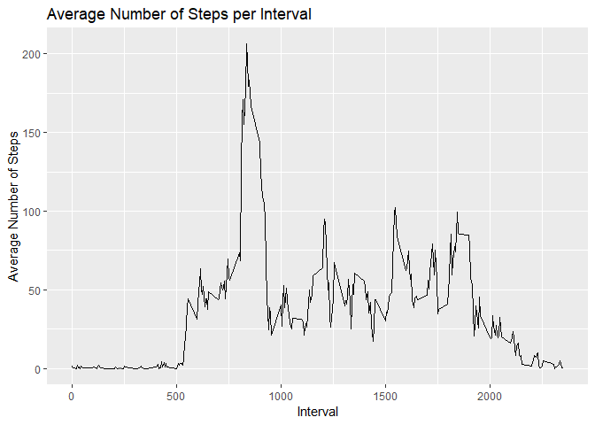

## Loading and preprocessing the data

```r
library(ggplot2)
library(plyr)
setwd("C:/Users/Praveen/Documents/GitAll/rpp1/")
activity <- read.csv("activity.csv")

activity$day <- weekdays(as.Date(activity$date))
activity$DateTime<- as.POSIXct(activity$date, format="%Y-%m-%d")
##pulling data without NA's
clean <- activity[!is.na(activity$steps),]
```


## What is mean total number of steps taken per day?


```r
## summarizing total steps per date
sumTable <- aggregate(activity$steps ~ activity$date, FUN=sum, )
colnames(sumTable)<- c("Date", "Steps")

## Creating the historgram of total steps per day
hist(sumTable$Steps, breaks=5, xlab="Steps", main = "Total Steps per Day")
```

<!-- -->

```r
## Mean of Steps
as.integer(mean(sumTable$Steps))
```

```
## [1] 10766
```

```r
## Median of Steps
as.integer(median(sumTable$Steps))
```

```
## [1] 10765
```
 MEAN OF TOTAL NUMBER OF STEPS : 10766

## What is the average daily activity pattern?

```r
library(plyr)
library(ggplot2)
##pulling data without nas
clean <- activity[!is.na(activity$steps),]

##create average number of steps per interval
intervalTable <- ddply(clean, .(interval), summarize, Avg = mean(steps))
##Create line plot of average number of steps per interval
p <- ggplot(intervalTable, aes(x=interval, y=Avg), xlab = "Interval", ylab="Average Number of Steps")
p + geom_line()+xlab("Interval")+ylab("Average Number of Steps")+ggtitle("Average Number of Steps per Interval")
```

<!-- -->

```r
##Maximum steps by interval
maxSteps <- max(intervalTable$Avg)
##Which interval contains the maximum average number of steps
intervalTable[intervalTable$Avg==maxSteps,1]
```

```
## [1] 835
```
###The maximum number of steps for a 5-minute interval was 206 steps.

###The 5-minute interval which had the maximum number of steps was the 835 interval.

## Imputing missing values

```r
##Number of NAs in original data set
nrow(activity[is.na(activity$steps),])
```

```
## [1] 2304
```

```r
## Create the average number of steps per weekday and interval
avgTable <- ddply(clean, .(interval, day), summarize, Avg = mean(steps))

## Create dataset with all NAs for substitution
nadata<- activity[is.na(activity$steps),]
## Merge NA data with average weekday interval for substitution
newdata<-merge(nadata, avgTable, by=c("interval", "day"))

## Reorder the new substituded data in the same format as clean data set
newdata2<- newdata[,c(6,4,1,2,5)]
colnames(newdata2)<- c("steps", "date", "interval", "day", "DateTime")

##Merge the NA averages and non NA data together
mergeData <- rbind(clean, newdata2)

##Create sum of steps per date to compare with step 1
sumTable2 <- aggregate(mergeData$steps ~ mergeData$date, FUN=sum )
colnames(sumTable2)<- c("Date", "Steps")

## Mean of Steps with NA data taken care of
as.integer(mean(sumTable2$Steps))
```

```
## [1] 10821
```

```r
## Median of Steps with NA data taken care of
as.integer(median(sumTable2$Steps))
```

```
## [1] 11015
```

```r
## Creating the histogram of total steps per day, categorized by data set to show impact
hist(sumTable2$Steps, breaks=5, xlab="Steps", main = "Total Steps per Day with NAs Fixed", col="Black")
hist(sumTable$Steps, breaks=5, xlab="Steps", main = "Total Steps per Day with NAs Fixed", col="Grey", add=T)
legend("topright", c("Imputed Data", "Non-NA Data"), fill=c("black", "grey") )
```

<!-- -->
The new mean of the imputed data is 10821 steps compared to the old mean of 10766 steps. That creates a difference of 55 steps on average per day.

The new median of the imputed data is 11015 steps compared to the old median of 10765 steps. That creates a difference of 250 steps for the median.

However, the overall shape of the distribution has not changed.

## Are there differences in activity patterns between weekdays and weekends?


```r
## Create new category based on the days of the week
mergeData$DayCategory <- ifelse(mergeData$day %in% c("Saturday", "Sunday"), "Weekend", "Weekday")

library(lattice) 

## Summarize data by interval and type of day
intervalTable2 <- ddply(mergeData, .(interval, DayCategory), summarize, Avg = mean(steps))

##Plot data in a panel plot
xyplot(Avg~interval|DayCategory, data=intervalTable2, type="l",  layout = c(1,2),
       main="Average Steps per Interval Based on Type of Day", 
       ylab="Average Number of Steps", xlab="Interval")
```

<!-- -->
Yes, the step activity trends are different based on whether the day occurs on a weekend or not. This may be due to people having an increased opportunity for activity beyond normal work hours for those who work during the week.
